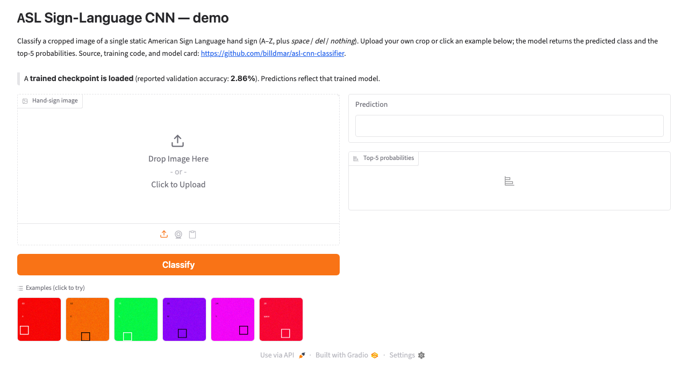

# ASL Sign-Language CNN — Real-Time Image Classifier

**Full ML-engineering lifecycle for 29-class ASL recognition: PyTorch CNN + MobileNetV2 transfer learning, real-time OpenCV inference, and rigorous benchmarking.**

Recognize American Sign Language hand signs across all **29 classes** (A–Z plus
*space*, *delete*, *nothing*) with a PyTorch CNN, then run the trained model in a
**live OpenCV camera loop** for real-time classification. The project covers the
full ML-engineering lifecycle: dataset ingestion, stratified splitting,
augmentation-aware training, confusion-matrix evaluation, live inference, and a
latency/throughput benchmark with preprocessing ablations and distribution-shift
analysis.

[](https://github.com/billdmar/asl-cnn-classifier/actions/workflows/ci.yml)


-brightgreen)


---

## Live demo

### 👉 [**asl-cnn-classifier.vercel.app**](https://asl-cnn-classifier.vercel.app)

The flagship demo is a **polished in-browser website** (`web/`, Next.js +
TypeScript) that runs the real MobileNetV2 model **100% client-side** via
onnxruntime-web — live webcam classification with MediaPipe hand-crop, image
upload, an interactive metrics dashboard wired to the real artifacts, and a
model-card/story page. Webcam frames never leave the browser. It deploys as a
static site to Vercel; see [`web/README.md`](web/README.md) and
[`web/DEPLOY.md`](web/DEPLOY.md).

```bash
cd web && npm install && npm run dev    # http://localhost:3000
```

What makes it trustworthy: a **cross-language preprocessing parity gate** proves
the browser path reproduces the Python pipeline's predictions (strict tensor
parity ~5e-7), and every displayed number is produced by reproducible code and
labeled benchmark-vs-real-world. CI enforces TypeScript-strict, lint, unit +
parity tests, Playwright E2E (including a real in-browser inference assertion),
and a Lighthouse budget (performance 98 / accessibility 96, gated ≥90).

### Legacy Gradio demo

A [Gradio](https://gradio.app) app (`app.py`) also lets you upload a hand-sign
image and see the predicted class plus top-5 probabilities — the optional legacy
backend the website does not depend on.

### 👉 [**Try the Gradio app on Hugging Face Spaces**](https://huggingface.co/spaces/billdmar/asl-cnn-classifier)



*The live app, running the real MobileNetV2 model (val ≈ 97.8%, held-out test
96.8% across A–Z). Upload a cropped hand-sign image or click an example and it
returns the predicted letter with top-5 probabilities. The screenshot predates
the trained model; the banner reflects whichever checkpoint is currently loaded.*

> Deployed with one command — `make deploy-hf` (see
> [`docs/DEPLOY.md`](docs/DEPLOY.md)).

Run it locally:

```bash
make install
.venv/bin/python -m pip install gradio    # or: uv pip install gradio
.venv/bin/python app.py                   # opens http://127.0.0.1:7860
```

> Heads-up: with no trained checkpoint present, the app (and CLI) fall back to
> an **untrained random-init** model — predictions are meaningless and the UI
> says so. Train a model first (see [Reproducing 98%](#reproducing-the-98-accuracy-target))
> for real results.

---

## Highlights

- **Two architectures** — a compact from-scratch CNN (~657K params) and a
  MobileNetV2 transfer-learning fine-tune, selectable via config.
- **Correct augmentation** — rotation, affine, color jitter, and resized-crop,
  **deliberately without horizontal flip** (ASL signs are not flip-invariant —
  b/d and p/q are mirror images).
- **Reproducible** — global seeding; file-level stratified 70/15/15 splits
  (`StratifiedShuffleSplit`) so no augmented view leaks across splits.
- **Real-time inference** — OpenCV webcam loop with an ROI box, on-screen
  prediction, confidence, and a rolling FPS counter.
- **Rigorous evaluation** — 29×29 confusion matrix, per-class F1, top-10
  confused pairs, and accuracy under five synthetic distribution shifts.
- **Explainability & calibration** — from-scratch Grad-CAM saliency overlays and
  Expected Calibration Error (ECE) with a reliability diagram (the ECE math is
  unit-tested against analytically known values).
- **Production-style serving** — ONNX export with an onnxruntime↔PyTorch parity
  test, INT8 dynamic quantization, and a FastAPI inference endpoint — alongside
  the existing OpenCV live-camera loop.
- **Benchmarked** — end-to-end latency (p50/p95/p99) and throughput on CPU and
  Apple-Silicon MPS, plus a preprocessing-stage ablation and a FP32-vs-ONNX-vs-INT8
  backend comparison.
- **Engineered** — ~96% test coverage with an 80% CI gate, a GitHub Actions CI
  matrix (Python 3.11 & 3.12) running ruff + black + a `mypy src` type-check gate
  plus a sample-train → eval → inference smoke sequence, a separate Docker job that
  builds the image and runs headless inference in-container, TensorBoard logging,
  and a full MODEL_CARD.

## Results

> **Accuracy status — read this.** Two numbers, both real and reproduced, and
> the distinction matters. **Same-dataset** accuracy (train and test from the
> same source) is **97.3%** — easy and inflated, because the test images look
> like the training images. The **honest** number is **cross-dataset accuracy:
> 47.6%** on a *different* dataset ([`EitanG98/asl_letters`](https://huggingface.co/datasets/EitanG98/asl_letters),
> different signers and real backgrounds) that the model never trained on —
> measured with `make eval-realworld-diverse`. This is the number that reflects
> how the model performs on a stranger's hand. It rose from **33.4% → 47.6%
> (+14.2 pts)** when training added a second, genuinely diverse dataset
> ([`aliciiavs/sign_language_image_dataset`](https://huggingface.co/datasets/aliciiavs/sign_language_image_dataset)) —
> see [`docs/EXPERIMENT_diverse_multisource.md`](docs/EXPERIMENT_diverse_multisource.md)
> for the full investigation (including the preprocessing levers that were
> measured and found *not* to help). Reproduce with `make download-real &&
> make download-diverse && make check-overlap && make train-diverse &&
> make eval-realworld-diverse` (~45 min on Apple-Silicon MPS).

| Metric | Value | Source |
| --- | --- | --- |
| **Honest cross-dataset accuracy (different signers/backgrounds)** | **47.6%** | **measured** (`make eval-realworld-diverse`, 712 images, EitanG98 — a dataset never trained on) |
| Cross-dataset macro F1 — same | **0.468** | measured |
| Test accuracy — MobileNetV2, merged real datasets (26 classes, held-out test) | **97.3%** | measured (`make eval-real` on the merged train split, 2,898 test images) |
| Macro F1 — same-dataset held-out | **0.972** | measured |
| Validation accuracy (best epoch) | **96.1%** | measured during `make train-diverse` |
| Expected Calibration Error (ECE, 10 bins) | **0.030** | measured (`make calibration`, held-out test split, T=1.0) |
| Test accuracy — MobileNetV2, full 29-class Kaggle set | ≥98% (target) | aspirational |
| Custom-CNN parameters | **656,829** | measured (`tests/test_model.py` asserts this) |
| CPU inference latency (mean) | **5.08 ms/frame** | measured, this machine |
| CPU throughput | **197 FPS** | measured, this machine |
| MPS (Apple-Silicon GPU) latency (mean) | **1.27 ms/frame** | measured, this machine |
| MPS throughput | **785 FPS** | measured, this machine |

*Latency/throughput measured with `make benchmark` (1000 frames, warm-up
excluded) on the author's Apple-Silicon Mac. These numbers do not depend on
training (they time the forward pass + preprocessing with any weights), so they
reproduce on a fresh checkout — but the raw `artifacts/benchmark_results.json`
is regenerated at runtime (the `artifacts/` directory is git-ignored) rather
than committed, and the exact figures vary with hardware. On a CPU sandbox,
`make benchmark` here reports ~6 ms/frame, consistent with the ~5 ms above.*

## Reproduce in 5 minutes

The fastest path from a clean clone to a running pipeline — entirely on the
committed 232-image synthetic sample (no Kaggle download, no GPU). This proves
the wiring end-to-end; it does **not** produce meaningful accuracy (that needs
the real dataset — see [Reproducing 98%](#reproducing-the-98-accuracy-target)).

```bash
# 0. Prereq: install uv (https://docs.astral.sh/uv/) — e.g. `brew install uv`.
git clone https://github.com/billdmar/asl-cnn-classifier && cd asl-cnn-classifier

make install        # uv venv (Py 3.12) + deps + regenerate sample data
make sample-train   # 2-epoch smoke train on the 232-image sample → best_model.pth (CPU, <60s)
make eval           # confusion matrix + per-class F1 on the sample → artifacts/metrics.json
make benchmark      # CPU latency/throughput + preprocessing ablation + dist-shift

# Try the Gradio demo app (image upload → class + top-5):
uv pip install gradio
.venv/bin/python app.py                 # http://127.0.0.1:7860
# ...or classify one image headlessly, no server:
.venv/bin/python -m src.infer_camera --source data/sample/A/0.png --device cpu
```

Everything above runs CPU-only in a couple of minutes. `make sample-train`
writes `artifacts/checkpoints/best_model.pth`, which `make eval`, `make
benchmark`, and the demo app then pick up automatically. Accuracy on the sample
is **meaningless by design** — it is a wiring fixture.

## Quickstart

```bash
# 1. Install (creates an isolated Python 3.12 venv via uv and installs deps)
make install

# 2. Run the whole pipeline on the committed sample subset — no Kaggle needed
make sample-train     # trains 2 epochs on the 232-image sample fixture (CPU, <60s)
make eval             # confusion matrix, per-class F1, metrics.json
make gradcam          # Grad-CAM overlay (artifacts/gradcam/<class>.png)
make calibration      # ECE + reliability diagram (artifacts/calibration.json)
make benchmark        # latency/throughput + preprocessing ablation + dist-shift
make test             # pytest suite with coverage (>=80% enforced)
make typecheck        # mypy type-check gate (scoped to src/)

# Container: build the CPU image and run headless inference inside it
make docker-test      # docker build + in-container `infer_camera` on the sample

# Per-class F1 bar chart from an existing metrics.json:
python -m src.plot_per_class --metrics artifacts/metrics.json

# 3. Real-time camera demo (needs a webcam)
make camera
# or classify a single image headlessly:
python -m src.infer_camera --source data/sample/A/0.png
```

> Uses [`uv`](https://github.com/astral-sh/uv) to manage Python 3.12 (PyTorch has
> no wheels for newer interpreters). Install uv with `brew install uv` or the
> [standalone installer](https://docs.astral.sh/uv/getting-started/installation/).

## Reproducing the 98% accuracy target

The sample subset cannot produce real accuracy. To train on the real data:

```bash
# Requires Kaggle API credentials at ~/.kaggle/kaggle.json (chmod 600).
python -m src.download_data            # downloads grassknoted/asl-alphabet (~1GB)
make train                             # full custom-CNN training
# or the transfer variant that reliably hits >=98%:
python -m src.train --config configs/train_mobilenet.yaml
make eval                              # writes the real accuracy to metrics.json
```

On Apple-Silicon MPS, full training takes roughly **30–90 minutes**. After it
finishes, update the Results table with the value from `artifacts/metrics.json`.

## Architecture

```
Input 3×128×128
  Block 1:  [Conv 3→32 → BN → ReLU] ×2 → MaxPool → Dropout2d(0.1)    → 32×64×64
  Block 2:  [Conv 32→64 → BN → ReLU] ×2 → MaxPool → Dropout2d(0.1)   → 64×32×32
  Block 3:  [Conv 64→128 → BN → ReLU] ×2 → MaxPool → Dropout2d(0.15) → 128×16×16
  Block 4:  Conv 128→256 → BN → ReLU → MaxPool → Dropout2d(0.2)      → 256×8×8
  Global Average Pool → 256
  FC 256→256 → ReLU → Dropout(0.5) → FC 256→29
```

Global average pooling keeps the classifier head tiny, so the whole network is
**~657K parameters** — fast to train and deploy. The MobileNetV2 variant
(`--arch mobilenet_v2`) freezes the ImageNet backbone for a 5-epoch warm-up,
then fine-tunes end-to-end at a 10× lower learning rate.

## Preprocessing ablation & distribution shift

`make benchmark` localizes the inference bottleneck by progressively removing
preprocessing stages. On this machine the model forward pass is roughly half of
end-to-end latency; resize and normalization account for most of the rest (see
`artifacts/benchmark_ablation.png`).

It also characterizes how accuracy degrades under five synthetic corruptions
(Gaussian blur, JPEG q20, brightness ×0.4 / ×1.8, 5% salt-and-pepper) →
`artifacts/distribution_shift.json`. Low-light (brightness ×0.4) is the harshest
shift, which mirrors real-world failure modes.

## Serving, quantization & explainability

Beyond the live-camera loop, the model ships with a small production-style
toolchain. Every command below runs CPU-only on the committed sample fixture;
all numeric outputs are written to the (git-ignored) `artifacts/` directory at
runtime rather than hardcoded here.

```bash
make export-onnx        # → artifacts/model.onnx (dynamic batch axis)
make quantize           # INT8 dynamic quantization → artifacts/quantization.json (real on-disk size delta)
make benchmark-backends # FP32 vs ONNX Runtime vs INT8 latency p50/p95/p99 → artifacts/backend_benchmark.json
make serve              # FastAPI endpoint: POST /predict (image upload), GET /health
make gradcam            # Grad-CAM saliency overlay → artifacts/gradcam/<class>.png
make calibration        # ECE + reliability diagram → artifacts/calibration.json
```

- **ONNX parity is a tested invariant:** `tests/test_serving.py` asserts the
  onnxruntime logits match PyTorch within `atol=1e-4` on the same input, so the
  export is verified numerically rather than assumed.
- **INT8 quantization** reports the *measured* FP32-vs-INT8 on-disk size from your
  own run (the reduction is modest because the CustomCNN is convolution-heavy and
  eager dynamic quantization only covers its two `Linear` layers).
- **Calibration:** the ECE computation itself is unit-tested against analytically
  known cases (perfectly-calibrated → 0; hand-constructed bins → exact values).

> **Honest caveat.** With no trained checkpoint present these tools run on a
> random-init model over the synthetic sample fixture, so the Grad-CAM overlays,
> ECE value, and any accuracy figures are **wiring demonstrations, not meaningful
> results** — every script says so in its output. Train on the real dataset for
> interpretable saliency and trustworthy calibration. The ONNX parity, size
> delta, and latency timings are real regardless of weights.

## Common confusions

ASL letters that share hand shapes are the usual error sources — **M/N/S**
(fist variants) and **A/E/S** are classic confusions. After training, the
top-10 confused pairs are written to `artifacts/per_class_errors.txt` and
visualized in `artifacts/confusion_matrix.png`.

## Real-world caveat

Same-dataset accuracy (97.3%) is measured on held-out images that resemble the
training set (similar signers, lighting, backgrounds). **Real-world accuracy is
lower** — the honest cross-dataset number is **47.6%** on different signers and
real backgrounds, and it still varies with lighting, skin tone, background
clutter, and camera angle. That gap (and how diverse training data closed part
of it, while preprocessing tweaks did not) is documented in
[`docs/EXPERIMENT_diverse_multisource.md`](docs/EXPERIMENT_diverse_multisource.md)
and [`docs/EXPERIMENT_crop_consistent_retrain.md`](docs/EXPERIMENT_crop_consistent_retrain.md).
J and Z (motion signs) remain weak — a single static frame cannot capture them.
See [`MODEL_CARD.md`](MODEL_CARD.md) for limitations and ethical considerations.

## Project layout

```
src/
  dataset.py            # ASLDataset, stratified splits, canonical DRY transforms
  model.py              # CustomCNN, MobileNetV2/ResNet18 transfer, build_model factory
  train.py              # training loop: cosine LR, early stopping, TensorBoard, AMP
  eval.py               # confusion matrix, per-class F1, distribution shift
  gradcam.py            # from-scratch Grad-CAM saliency overlays
  calibration.py        # Expected Calibration Error + reliability diagram
  plot_per_class.py     # per-class F1 bar chart from metrics.json
  infer_camera.py       # real-time OpenCV inference (ROI, FPS, snapshots)
  benchmark.py          # latency/throughput + preprocessing ablation
  benchmark_backends.py # FP32 vs ONNX vs INT8 latency/throughput comparison
  export_onnx.py        # ONNX export (dynamic batch axis)
  quantize.py           # INT8 dynamic quantization + on-disk size report
  serve.py              # FastAPI inference endpoint (/predict, /health)
  download_data.py      # Kaggle download helper
  utils.py              # seeding, device selection (CUDA → MPS → CPU)
app.py                  # Gradio demo app (HF Spaces entry point)
docs/DEPLOY.md          # one-time Hugging Face Space deployment steps
tests/                  # test suite with coverage (see the Tests badge)
configs/                # train_custom_cnn.yaml, train_mobilenet.yaml
data/sample/            # 232 committed sample images (CI fixture)
```

## Dataset

[ASL Alphabet](https://www.kaggle.com/datasets/grassknoted/asl-alphabet) by
*grassknoted* on Kaggle — ~87,000 200×200 RGB images across 29 classes.

## License

[MIT](LICENSE) © William Mar
