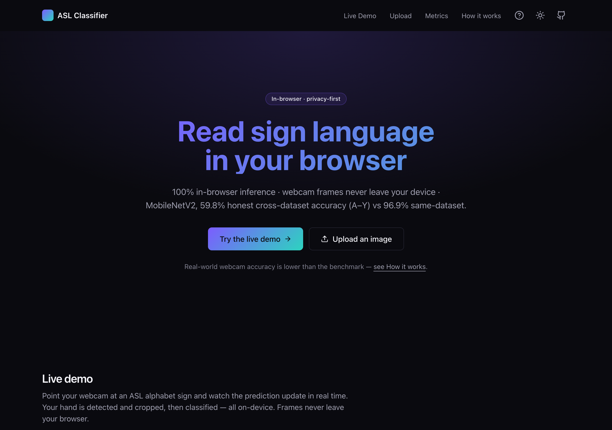
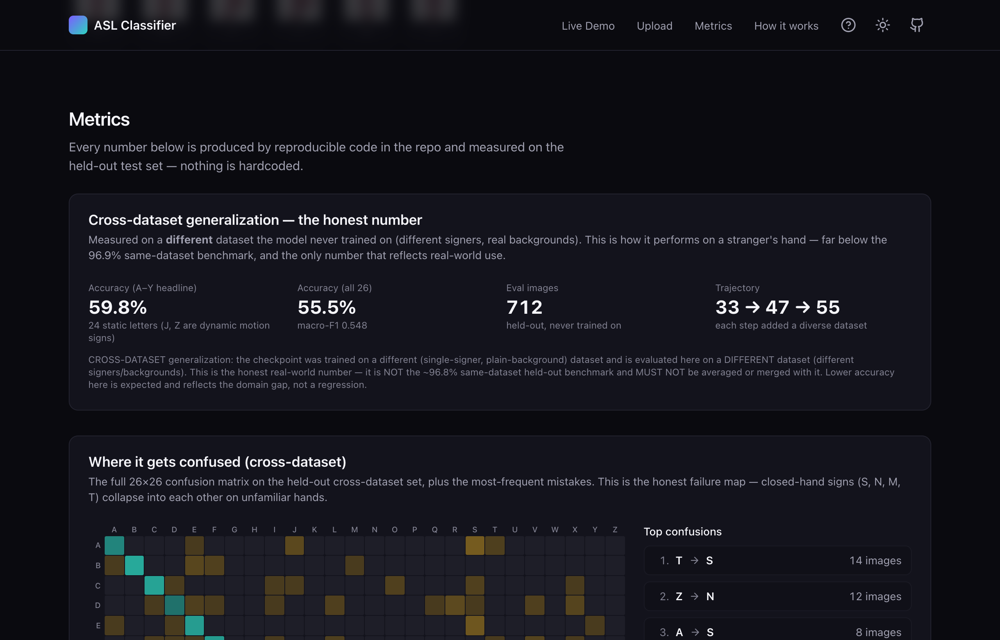

# ASL Alphabet Classifier — Live In-Browser ML Web App

**A production-quality web app that recognizes American Sign Language letters from your webcam, running the model 100% in the browser — plus an honest, fully-documented account of what it actually achieves on a stranger's hand.**

### ▶ Live demo: **[asl-cnn-classifier.vercel.app](https://asl-cnn-classifier.vercel.app)** — no install, runs entirely client-side

[](https://asl-cnn-classifier.vercel.app)
[](https://github.com/billdmar/asl-cnn-classifier/actions/workflows/ci.yml)


MobileNetV2 classifies ASL alphabet letters **entirely in the browser** via ONNX Runtime Web + MediaPipe hand-crop — webcam frames never leave the device. The full ML lifecycle ships behind it: PyTorch training, ONNX export with a cross-language parity gate, calibration, and CI.

- **Installable PWA** — offline-capable, IndexedDB model cache, dark/light theme, keyboard shortcuts
- **Honest accuracy** — headline is **55.5% cross-dataset** (59.8% on static A–Y), not the leakage-inflated 96.9% same-dataset figure; every accuracy lever tried and rejected is documented
- **CI-verified** — TypeScript strict, unit + parity + Playwright E2E, Lighthouse budget (perf 98 / a11y 96)



*The live app: ASL letters classified from the webcam entirely client-side via
onnxruntime-web — frames never leave the browser. The headline number is the honest
real-world figure (55.5% cross-dataset / 59.8% on static A–Y), not the leakage-inflated
same-dataset benchmark.*

---

## Contents

- [Run the web app](#run-the-web-app)
- [Reproduce in 5 minutes](#reproduce-in-5-minutes)
- [Quickstart](#quickstart)
- [Key engineering decisions](#key-engineering-decisions)
- [The honest-accuracy story](#the-honest-accuracy-story)
- [Interactive explainer](#see-what-the-model-sees)
- [Highlights](#highlights)
- [Results](#results)
- [Reproducing the deployed model](#reproducing-the-deployed-model-555-honest-cross-dataset)
- [Architecture](#architecture)
- [Serving, quantization & explainability](#serving-quantization--explainability)
- [Project layout](#project-layout)

---

## Run the web app

The flagship is the `web/` site (Next.js + TypeScript, static export to Vercel). Run it
locally:

```bash
cd web && npm install && npm run dev    # http://localhost:3000
```

See [`web/README.md`](web/README.md) and [`web/DEPLOY.md`](web/DEPLOY.md). What makes it
trustworthy: a **cross-language preprocessing parity gate** proves the browser path
reproduces the Python pipeline's predictions (strict tensor parity ~5e-7), and every
displayed number is produced by reproducible code and labeled benchmark-vs-real-world. CI
enforces TypeScript-strict, lint, unit + parity tests, Playwright E2E (including a real
in-browser inference assertion), and a Lighthouse budget (performance 98 / accessibility 96,
gated ≥90).

Product niceties:

- **Instant repeat visits** — the ~9 MB model is cached in IndexedDB (keyed by
  build SHA), so after the first load it starts with no re-download.
- **Keyboard shortcuts** — `Space` start/stop camera, `C` copy the spelled word,
  `R` reset, `S` share, `?` for the help dialog.
- **Shareable results** — share a prediction as a link; `/result` renders the
  exact letter + probabilities client-side from the URL.
- **Dark / light theme** — persisted toggle, WCAG-AA contrast-verified in both
  themes via axe, no-flash pre-paint script.
- **Installable + offline PWA** — service worker caches the app shell so it runs
  offline after the first visit.

---

## Reproduce in 5 minutes

The fastest path from a clean clone to a running pipeline — entirely on the
committed 232-image synthetic sample (no Kaggle download, no GPU). This proves
the wiring end-to-end; it does **not** produce meaningful accuracy (that needs
the real dataset — see
[Reproducing the deployed model](#reproducing-the-deployed-model-555-honest-cross-dataset)).

```bash
# 0. Prereq: install uv (https://docs.astral.sh/uv/) — e.g. `brew install uv`.
git clone https://github.com/billdmar/asl-cnn-classifier && cd asl-cnn-classifier

make install        # uv venv (Py 3.12) + deps + regenerate sample data
make sample-train   # 2-epoch smoke train on the 232-image sample → best_model.pth (CPU, <60s)
make eval           # confusion matrix + per-class F1 on the sample → artifacts/metrics.json
make benchmark      # CPU latency/throughput + preprocessing ablation + dist-shift

# Classify one image headlessly, no server:
.venv/bin/python -m src.infer_camera --source data/sample/A/0.png --device cpu
```

Everything above runs CPU-only in a couple of minutes. Accuracy on the sample
is **meaningless by design** — it is a wiring fixture.

## Quickstart

```bash
# 1. Install (creates an isolated Python 3.12 venv via uv and installs deps)
make install

# 2. Run the whole pipeline on the committed sample subset — no Kaggle needed
make sample-train     # trains 2 epochs on the 232-image sample fixture (CPU, <60s)
make eval             # confusion matrix, per-class F1, metrics.json
make gradcam          # Grad-CAM overlay (artifacts/gradcam/<class>.png)
make calibration      # ECE + reliability diagram (artifacts/calibration.json)
make benchmark        # latency/throughput + preprocessing ablation + dist-shift
make test             # pytest suite with coverage (>=80% enforced)
make typecheck        # mypy type-check gate (scoped to src/)

# Container: build the CPU image and run headless inference inside it
make docker-test      # docker build + in-container `infer_camera` on the sample

# 3. Real-time camera demo (needs a webcam)
make camera
# or classify a single image headlessly:
python -m src.infer_camera --source data/sample/A/0.png
```

> Uses [`uv`](https://github.com/astral-sh/uv) to manage Python 3.12 (PyTorch has
> no wheels for newer interpreters). Install uv with `brew install uv` or the
> [standalone installer](https://docs.astral.sh/uv/getting-started/installation/).

---

## Key engineering decisions

| Decision | Rationale |
|----------|-----------|
| **No horizontal flip** in augmentation | ASL signs are not flip-invariant — b/d, p/q are mirror images. Flipping creates mislabeled training data. |
| **Cross-dataset gate** as the shipping metric | Same-dataset accuracy is inflated by video-frame leakage; only a stranger's hand measures real generalization. |
| **File-level stratified splits** | Prevents augmented views of the same image leaking across train/test. Dedup-aware mode clusters near-duplicate video frames. |
| **Single source of truth** for transforms | `get_eval_transforms()` is imported by every consumer — no silent preprocessing drift between training and inference. |
| **Negative results documented** | Every rejected lever (TTA, thresholds, temperature, architecture swaps) has a written experiment report — shows rigor, not just successes. |
| **Cross-language parity test** | The browser (TypeScript/ONNX) and Python paths must agree to ~5e-7 — not assumed, CI-tested. |

---

## The honest-accuracy story

Most portfolio models report whatever number looks best. This one reports the number that's
*true*. A naive split of single-signer data gives a flattering **96.9% same-dataset**
accuracy — but those test images look just like the training images, so it's inflated by
leakage. The number that matters is **cross-dataset accuracy on a different dataset the model
never trained on** (different signers, real backgrounds): **55.5% across 26 classes, 59.8% on
the static A–Y letters** (J and Z are dynamic motion signs a single frame can't capture). I
treated *that* as the only metric allowed to decide what ships.

Improving it was an experiment, not a guess. Stacking genuinely diverse training datasets
moved it **33.4% → 47.6% → 55.5%**. Every other lever — crop-consistency, sketch-cleaning,
augmentation tiers, per-class thresholds, TTA, temperature calibration, class-balanced loss,
SWA + label smoothing, and two architecture swaps — was measured and **rejected**, then
written up as a negative result. The investigation closes formally at a documented
"supply-exhausted" ceiling. Full record: [`docs/`](docs/).



*The live metrics dashboard: the honest cross-dataset numbers, the 33→47→55 diversity
trajectory, and the real 26×26 confusion matrix — every value produced by reproducible repo
code, never hardcoded.*

---

## Highlights

- **Live in-browser web app** — Next.js + TypeScript running MobileNetV2 **100%
  client-side** (onnxruntime-web + MediaPipe), deployed to Vercel as an installable,
  offline-capable PWA. Webcam frames never leave the device.
- **Interactive inference explainer** — freeze any frame and step through the pipeline:
  hand detection, 128×128 crop, ImageNet-normalized tensor channels, and a temperature
  slider that reshapes the probability distribution in real time.
- **Honest accuracy, fully investigated** — the deploy decider is a held-out *cross-dataset*
  gate (55.5% / 59.8% A–Y), not the leakage-inflated 96.9% benchmark; every rejected lever is
  documented as a negative result to a formal closure.
- **Cross-language parity gate** — the browser inference path is proven to reproduce the
  Python pipeline's predictions to ~5e-7 tensor agreement, enforced in CI.
- **Two architectures** — a compact from-scratch CNN (~657K params, baseline) and the deployed
  MobileNetV2 transfer-learning fine-tune, selectable via config.
- **Correct augmentation** — rotation, affine, color jitter, and resized-crop,
  **deliberately without horizontal flip** (ASL signs are not flip-invariant —
  b/d and p/q are mirror images).
- **Reproducible** — global seeding; file-level stratified 70/15/15 splits
  (`StratifiedShuffleSplit`) so no augmented view leaks across splits; one-command
  `make reproduce-deployed`.
- **Rigorous evaluation** — a 26×26 confusion matrix, per-class F1, top confused
  pairs, accuracy under five synthetic distribution shifts, and from-scratch Grad-CAM
  saliency overlays.
- **Production-style serving** — ONNX export with an onnxruntime↔PyTorch parity
  test, INT8 dynamic quantization, FastAPI inference endpoint, and a FP32-vs-ONNX-vs-INT8
  multi-backend benchmark.
- **Calibrated** — Expected Calibration Error (ECE) with a reliability diagram; the
  ECE math is unit-tested against analytically known values.
- **Engineered** — ~96% test coverage with an 80% CI gate, a GitHub Actions CI
  matrix (Python 3.11 & 3.12) running ruff + black + mypy, Docker build verification,
  TensorBoard logging, and a full MODEL_CARD.

## Results

| Metric | Value | Source |
| --- | --- | --- |
| **Honest cross-dataset accuracy, A–Y headline (no dynamic J/Z)** | **59.8%** | **measured** (`make eval-realworld-diverse-hemg`, EitanG98 — never trained on) |
| Cross-dataset macro F1 — A–Y | **0.603** | measured |
| Honest cross-dataset accuracy — full 26 classes (incl. J/Z) | **55.5%** | measured |
| Cross-dataset macro F1 — 26 classes | **0.548** | measured |
| Test accuracy — MobileNetV2, merged real datasets (26 classes, held-out test) | **96.9%** | measured (`make eval-real` on the merged train split, 3,170 test images) |
| Macro F1 — same-dataset held-out | **0.969** | measured |
| Validation accuracy (best epoch) | **97.3%** | measured during `make train-diverse-hemg` |
| Expected Calibration Error (ECE, 10 bins) | **0.025** | measured (`make calibration`, held-out test split, T=1.0) |
| Custom-CNN parameters | **656,829** | measured (`tests/test_model.py` asserts this) |
| CPU inference latency (mean) | **5.08 ms/frame** | measured, this machine |
| CPU throughput | **197 FPS** | measured, this machine |
| MPS (Apple-Silicon GPU) latency (mean) | **1.27 ms/frame** | measured, this machine |
| MPS throughput | **785 FPS** | measured, this machine |

*Latency/throughput measured with `make benchmark` (1000 frames, warm-up
excluded) on the author's Apple-Silicon Mac. The exact figures vary with hardware.*

## Reproducing the deployed model (55.5% honest cross-dataset)

The committed sample subset is only a wiring fixture — it can't produce real
accuracy. The deployed model is a MobileNetV2 trained on the **union of three
public, credential-free Hugging Face datasets** and judged on a **fourth** it
never trains on. Full pipeline from a fresh checkout (~50 min on Apple-Silicon
MPS):

```bash
make reproduce-deployed     # one command — runs the whole pipeline below in order
```

…or step through it yourself (the individual targets `reproduce-deployed` chains):

```bash
make download-real          # Marxulia (single signer, plain bg) — A–Z
make download-diverse       # aliciiavs (multi-signer, real backgrounds) — A–Y
make download-hemg          # Hemg (plain bg, includes J/Z)
make download-crossval      # EitanG98 — the HELD-OUT eval gate (never trained on)
make check-overlap-hemg     # perceptual-hash guard: 0% train↔eval contamination
make train-diverse-hemg     # 3-source union → artifacts/checkpoints_diverse_hemg/
make eval-realworld-diverse-hemg   # the honest number → realworld_eval_*.json
```

The honest cross-dataset result lands in `artifacts/realworld_eval_diverse_hemg.json`
(**55.5% all-26 / 59.8% A–Y headline**). The same-dataset benchmark (96.9%) comes
from `make eval-real`. Everything is seeded (`seed: 42`) and the splits are
file-level stratified, so runs are reproducible. The full journey — including the
levers that were measured and rejected — is documented honestly in
[`docs/EXPERIMENT_*.md`](docs/).

## Architecture

```
Input 3×128×128
  Block 1:  [Conv 3→32 → BN → ReLU] ×2 → MaxPool → Dropout2d(0.1)    → 32×64×64
  Block 2:  [Conv 32→64 → BN → ReLU] ×2 → MaxPool → Dropout2d(0.1)   → 64×32×32
  Block 3:  [Conv 64→128 → BN → ReLU] ×2 → MaxPool → Dropout2d(0.15) → 128×16×16
  Block 4:  Conv 128→256 → BN → ReLU → MaxPool → Dropout2d(0.2)      → 256×8×8
  Global Average Pool → 256
  FC 256→256 → ReLU → Dropout(0.5) → FC 256→29
```

Global average pooling keeps the classifier head tiny, so the whole network is
**~657K parameters** — fast to train and deploy. The MobileNetV2 variant
(`--arch mobilenet_v2`) freezes the ImageNet backbone for a 3-epoch warm-up,
then fine-tunes end-to-end at a 10× lower learning rate.

## Serving, quantization & explainability

Beyond the live-camera loop, the model ships with a small production-style
toolchain. Every command below runs CPU-only on the committed sample fixture;
all numeric outputs are written to the (git-ignored) `artifacts/` directory at
runtime rather than hardcoded here.

```bash
make export-onnx        # → artifacts/model.onnx (dynamic batch axis)
make quantize           # INT8 dynamic quantization → artifacts/quantization.json (real on-disk size delta)
make benchmark-backends # FP32 vs ONNX Runtime vs INT8 latency p50/p95/p99 → artifacts/backend_benchmark.json
make serve              # FastAPI endpoint: POST /predict (image upload), GET /health
make gradcam            # Grad-CAM saliency overlay → artifacts/gradcam/<class>.png
make calibration        # ECE + reliability diagram → artifacts/calibration.json
```

- **ONNX parity is a tested invariant:** `tests/test_serving.py` asserts the
  onnxruntime logits match PyTorch within `atol=1e-4` on the same input.
- **INT8 quantization** reports the *measured* FP32-vs-INT8 on-disk size delta.
- **Calibration:** the ECE computation is unit-tested against analytically known values.

> **Honest caveat.** With no trained checkpoint present these tools run on a
> random-init model over the synthetic sample fixture — every script says so in
> its output. Train on the real dataset for meaningful results.

## Project layout

```
src/
  checkpoint.py         # canonical model loading (single source of truth)
  dataset.py            # ASLDataset, stratified splits, canonical DRY transforms
  degradations.py       # synthetic image corruptions for robustness evaluation
  model.py              # CustomCNN, MobileNetV2/ResNet18 transfer, build_model factory
  train.py              # training loop: cosine LR, early stopping, TensorBoard, AMP
  eval.py               # confusion matrix, per-class F1, distribution shift
  gradcam.py            # from-scratch Grad-CAM saliency overlays
  calibration.py        # Expected Calibration Error + reliability diagram
  infer_camera.py       # real-time OpenCV inference (ROI, FPS, snapshots)
  benchmark.py          # latency/throughput + preprocessing ablation
  benchmark_backends.py # FP32 vs ONNX vs INT8 latency/throughput comparison
  export_onnx.py        # ONNX export (dynamic batch axis)
  quantize.py           # INT8 dynamic quantization + on-disk size report
  serve.py              # FastAPI inference endpoint (/predict, /health)
  utils.py              # seeding, device selection (CUDA → MPS → CPU)
app.py                  # Gradio demo app (HF Spaces entry point)
web/                    # Next.js + TypeScript in-browser classifier site
tests/                  # 238 tests, ~96% coverage (see the CI badge)
configs/                # YAML training configs (custom CNN, transfer variants)
data/sample/            # 232 committed sample images (CI fixture)
docs/                   # experiment write-ups (including negative results)
```

## Dataset

[ASL Alphabet](https://www.kaggle.com/datasets/grassknoted/asl-alphabet) by
*grassknoted* on Kaggle — ~87,000 200×200 RGB images across 29 classes.
The deployed model trains on the **union of three HuggingFace Hub datasets**
(Marxulia, aliciiavs, Hemg) for diversity; see
[Reproducing the deployed model](#reproducing-the-deployed-model-555-honest-cross-dataset).

## License

[MIT](LICENSE) © William Mar
